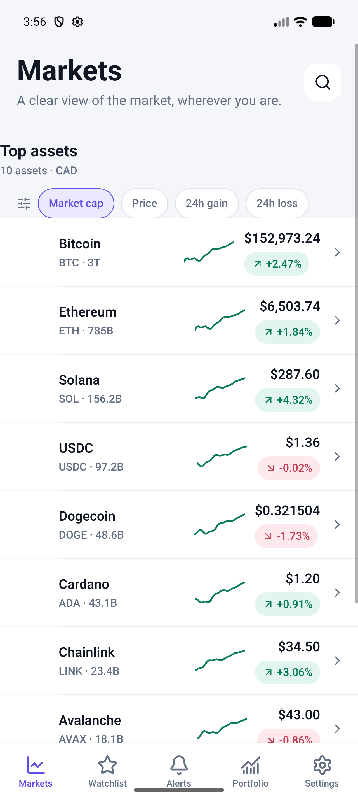
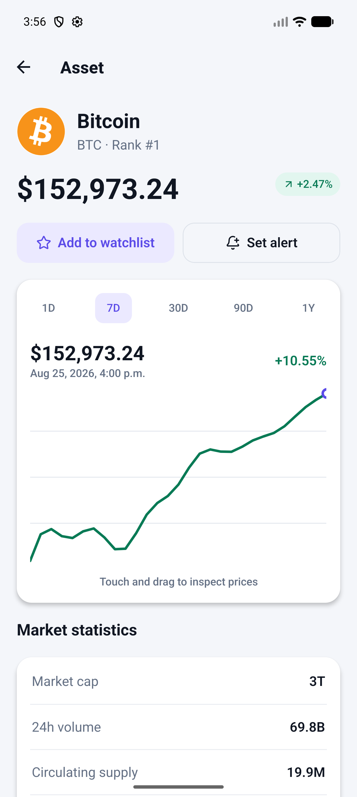
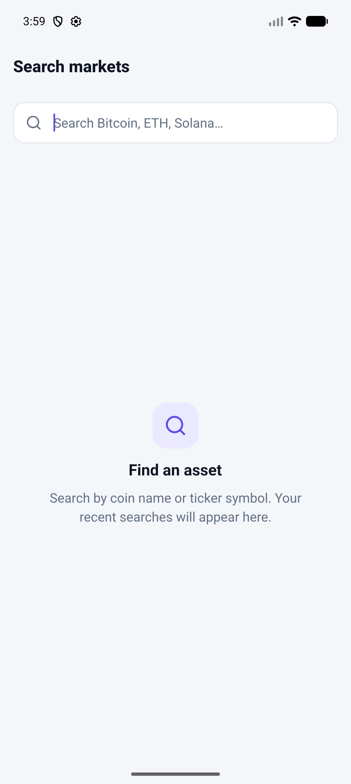
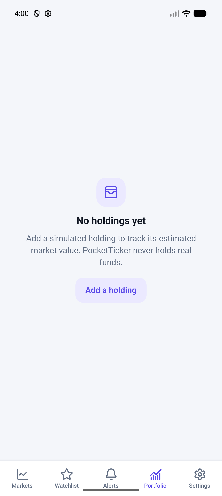

# PocketTicker

<p align="center">
  <strong>Modern Android Market Intelligence Application Built with React Native & TypeScript</strong>
</p>

<p align="center">
  
  
  
  
  
  
</p>

---

## 📌 Project Overview & Purpose

**PocketTicker** is an engineering portfolio project demonstrating the design and implementation of a production-style, offline-first mobile application on Android. It highlights real-world mobile engineering practices, including native module integrations, persistent domain repositories, server-state synchronization with offline fallback, Android Keystore-backed biometric/device authentication, background alert tasks, accessibility, and strict automated testing.

Its product scope is intentionally trading-adjacent: asset discovery and sorting, detailed price/chart exploration, watchlists, alerts, and simulated portfolio monitoring, without executing trades or handling funds.

> ⚠️ **Portfolio Project Notice**: PocketTicker is an educational market intelligence and tracking demonstration. It **does not support real trading, crypto wallets, funds custody, brokerage accounts, or real financial transactions**. All portfolio tracking is strictly simulated with local data.

## 📱 Screenshots

<p align="center">
  
  &nbsp;&nbsp;
  
</p>

<p align="center">
  
  &nbsp;&nbsp;
  
</p>

The UI is built as a native React Native Android experience with responsive layouts, accessible controls, dark/light/system themes, and clear loading, empty, offline, and error states.

---

## ✨ Features

- **📊 Real-Time & Historical Market Intelligence**:
  - Live price feeds, 24-hour price change percentage, volume, market capitalization, circulating supply, and all-time statistics.
  - Interactive SVG price chart with multi-timeframe switching (`1D`, `7D`, `30D`, `90D`, `1Y`) and touch scrubbing to inspect specific timestamp values.
  - Fast sorting by market cap, price, top gainers, and top losers.

- **⭐ Local Watchlist & Sorting**:
  - Persistent watchlist backed by local storage.
  - Custom list reordering with single-tap up/down movement and fast removal.

- **💼 Simulated Portfolio & Privacy Mode**:
  - Track simulated holdings without wallet connection or custody risk.
  - Dynamic portfolio valuation, asset allocation percentages, and calculated gain/loss metrics.
  - **Privacy Mode (Hide Balances)**: Instant masking of values (`••••••`) across all portfolio and market screens.

- **🔔 Opportunistic Price Alerts & Notifications**:
  - Configure directional alerts (price rises above / price falls below target).
  - Dedicated Android notification channel (`price-alerts`) with high priority heads-up notifications.
  - Background alert evaluations via Android `JobScheduler` (`react-native-background-fetch`) and headless task execution upon boot and app wake.

- **🛡️ Biometric & Device Credential App Lock**:
  - Android Keystore-backed biometric/device authentication (Fingerprint, Face, or Device Passcode) via `react-native-keychain`.
  - Secure sentinel storage: protected key retrieval prevents exposing balances or sensitive screens until authentication succeeds.
  - `StartupGate` architecture: zero flashing of protected content during app launch or cold resume.

- **🔍 Debounced Market Search & History**:
  - Instant debounced asset search across symbols and names.
  - Persistent recent search terms and recently viewed asset carousels.

- **🌐 Offline-First Architecture**:
  - Full TanStack React Query cache persisted locally to AsyncStorage.
  - Persistent cached state restored on cold startup with stale data indicators and offline banners.
  - Automatic background refetching and recovery when connectivity is restored (`@react-native-community/netinfo`).

- **🎨 Multi-Theme & Currency Localization**:
  - Dark, Light, and System appearance modes with high-contrast, accessible palettes.
  - Multi-currency support: `CAD`, `USD`, `EUR`, and `GBP` with formatted localized display.

- **🔗 Deep Linking**:
  - Native intent filter and URL routing for `pocketticker://asset/:assetId`.

- **🛠️ Diagnostics & Non-Invasive Analytics**:
  - Built-in runtime diagnostic dashboard for development builds (active cache count, network state, notification permissions, biometric capability).
  - Abstracted privacy-first analytics pipeline with sensitive financial masking.

---

## 🏗️ Architecture & Technology Stack

```
PocketTicker Architecture:
┌────────────────────────────────────────────────────────┐
│                      UI Layer                          │
│  React Navigation (Native Stack + Bottom Tabs)         │
│  Theme Context (Light / Dark / System)                 │
│  Accessible Components & Native SVG Charts            │
└──────────────────────────┬─────────────────────────────┘
                           │
       ┌───────────────────┴───────────────────┐
       ▼                                       ▼
┌──────────────────────────────┐ ┌──────────────────────────────┐
│     Server State Layer       │ │      Local State Layer       │
│  TanStack React Query        │ │  Zustand Preferences Store   │
│  AsyncStorage Persister      │ │  Zustand Snackbar Store      │
│  NetInfo Connectivity Sync   │ │  Biometric Service / Gate    │
└──────────────┬───────────────┘ └──────────────┬───────────────┘
               │                                │
               ▼                                ▼
┌──────────────────────────────┐ ┌──────────────────────────────┐
│     Market Data Layer        │ │     Repository Layer         │
│  MarketDataProvider Interface│ │  WatchlistRepository         │
│  ├── MockMarketDataProvider  │ │  PortfolioRepository         │
│  └── CoinGeckoProvider (Zod) │ │  AlertRepository             │
│  HTTP Client + Retry Policy  │ │  PreferencesRepository       │
└──────────────────────────────┘ └──────────────────────────────┘
```

### Technology Stack

| Layer | Technology | Purpose |
| :--- | :--- | :--- |
| **Framework** | React Native `0.87.0`, React `19.2.3` | Mobile application runtime |
| **Language** | TypeScript (Strict mode) | Type safety across API, stores, and components |
| **Navigation** | `@react-navigation/native-stack`, `@react-navigation/bottom-tabs` `v7` | Native screen transitions and tab navigation |
| **Server State** | `@tanstack/react-query` `v5` + `@tanstack/query-async-storage-persister` | Caching, deduplication, and offline hydration |
| **Client State** | `zustand` `v5` | Lightweight UI and preference state management |
| **Local Storage**| `@react-native-async-storage/async-storage` `v3` | Local domain repository and query cache persistence |
| **Security** | `react-native-keychain` `v10` | Android KeyStore & Biometric authentication |
| **Notifications**| `@notifee/react-native` `v9` | Android notification channel & alert delivery |
| **Background** | `react-native-background-fetch` `v4` | Opportunistic periodic background alert checking |
| **Data Validation**| `zod` `v4` | Runtime schema validation for market API payloads |
| **Graphics** | `react-native-svg` `v15`, `lucide-react-native` | Interactive SVG sparklines and price charts |
| **Testing** | `jest` `v29`, `@testing-library/react-native` | Unit, repository, service, and component testing |
| **CI** | GitHub Actions | Automated lint, typecheck, unit test, and Android build |

---

## 📂 Project Structure

```
PocketTicker/
├── .github/
│   └── workflows/
│       └── ci.yml                 # Automated CI workflow
├── android/                       # Native Android Gradle project
│   ├── app/
│   │   ├── src/main/
│   │   │   ├── AndroidManifest.xml # Permissions, singleTask, deep link filters
│   │   │   └── java/com/pocketticker/
│   │   │       ├── MainActivity.kt
│   │   │       └── MainApplication.kt
│   │   └── build.gradle
│   └── build.gradle
├── src/
│   ├── api/                       # Market Data Layer
│   │   ├── mappers/               # API response to domain model mappers
│   │   ├── providers/             # Mock & CoinGecko provider implementations
│   │   ├── schemas/               # Zod validation schemas
│   │   ├── client.ts              # HTTP client with timeouts, aborts, and error mapping
│   │   └── provider.ts            # Provider factory & configuration
│   ├── app/                       # Core App Providers & Startup
│   │   ├── alertTasks.ts          # Alert execution logic
│   │   ├── AppProviders.tsx       # Query, Theme, Safe Area, and Gesture roots
│   │   ├── queryClient.ts         # React Query configuration & persister
│   │   └── StartupGate.tsx        # Bootstrapping & biometric security gate
│   ├── components/                # Reusable UI Components
│   │   ├── AppText.tsx            # Typography system
│   │   ├── AssetIcon.tsx          # Remote logo with fallback avatar
│   │   ├── Button.tsx             # Accessible button variants
│   │   ├── PriceChart.tsx         # Interactive SVG touch chart
│   │   ├── MarketRow.tsx          # Market asset list row
│   │   └── Screen.tsx             # SafeArea-aware container
│   ├── features/                  # Feature Modules & Screens
│   │   ├── alerts/                # Alerts list & alert editor
│   │   ├── asset/                 # Asset detail screen & market chart
│   │   ├── markets/               # Market overview & sorting
│   │   ├── portfolio/             # Simulated portfolio & holding editor
│   │   ├── search/                # Debounced asset search
│   │   ├── security/              # Biometric lock configuration
│   │   └── settings/              # Settings, About, and Diagnostics
│   ├── repositories/              # Persistent Local Repositories
│   │   ├── AlertRepository.ts
│   │   ├── PortfolioRepository.ts
│   │   ├── PreferencesRepository.ts
│   │   ├── RecentSearchRepository.ts
│   │   ├── RecentlyViewedRepository.ts
│   │   └── WatchlistRepository.ts
│   ├── services/                  # Hardware & Background Services
│   │   ├── alertEngine.ts         # Threshold evaluation engine
│   │   ├── analytics.ts           # Privacy-safe event logger
│   │   ├── backgroundAlerts.ts    # Background fetch & headless task bridge
│   │   ├── biometricService.ts    # Keychain & biometric auth
│   │   └── notificationService.ts # Android notification channel & dispatch
│   ├── store/                     # Global Zustand Stores
│   ├── theme/                     # Light & Dark color tokens and typography
│   ├── types/                     # Shared TypeScript domain types
│   └── utils/                     # Formatters, calculations, and helpers
├── __tests__/                     # App smoke tests
├── jest.config.js                 # Jest preset and module transform config
├── jest.setup.ts                  # Comprehensive native module mocks
├── package.json
└── tsconfig.json
```

---

## ⚙️ Configuration & Market Data Modes

PocketTicker supports two market data providers configurable via `.env`:

```ini
# .env
MARKET_DATA_PROVIDER=mock
COINGECKO_API_KEY=
```

### Provider Comparison

| Feature | `mock` Mode (Default) | `coingecko` Mode |
| :--- | :--- | :--- |
| **API Key Required** | No (Works offline / zero credentials) | Optional (Demo tier or Pro key) |
| **Asset Count** | 10 realistic assets with generated sparklines | Live CoinGecko market data (configurable page size up to 250) |
| **Historical Charts** | Generated deterministic curves | Real historical prices from CoinGecko |
| **Rate Limiting** | None | Public rate limits handled gracefully |
| **Offline Demo** | ✅ Perfect for grading & demoing | Dependent on internet & API availability |

---

## 🚀 Setup & Local Development

### Prerequisites

- **Node.js**: `>= 22.11.0`
- **npm**: `>= 10.x`
- **Android Studio**: Android SDK (API 24 - 35), Android NDK `27.1.12297006`, and JDK 17 / 21 (`jbr`)
- **Android Emulator or Physical Android Device**

### 1. Install Dependencies

```bash
npm install
```

### 2. Configure Environment

```bash
cp .env.example .env
```

### 3. Verify Baseline Checks

```bash
# Type check TypeScript
npm run typecheck

# Lint codebase (ESLint)
npm run lint

# Run Jest unit and integration tests
npm test
```

Or run the complete local verification set:

```bash
npm run check
```

The GitHub Actions workflow runs linting, TypeScript checks, Jest tests, and an Android debug build on pushes and pull requests to `main`.

### 4. Run on Android

#### Option A: Command Line (Metro + Android Run)

```bash
# Start Metro bundler in one terminal
npm start

# In another terminal, launch on emulator/device
npm run android
```

#### Option B: Android Studio

1. Open Android Studio.
2. Select **Open an Existing Project** and navigate to the `android/` directory inside `PocketTicker`.
3. Allow Gradle to sync.
4. Select your connected device/AVD and click **Run** (`Shift + F10`).
5. In your terminal, run `npm start` to provide the JavaScript bundle.

---

## 🧪 Testing Strategy

PocketTicker has a comprehensive automated test suite covering all business logic, services, repositories, and state transitions:

```bash
npm test
```

### Tested Domains

- **API & Client**:
  - Schema validation with Zod runtime parsing (`schemasAndMappers.test.ts`).
  - Rate-limit error handling (429 mapping) and retry logic.
  - Abort signals, request timeouts, and error classification (`client.test.ts`).
  - Mock provider deterministic responses (`MockMarketDataProvider.test.ts`).

- **Repositories & Storage**:
  - CRUD operations, item limits, and ordering across Watchlist, Portfolio, Alerts, Preferences, and Recent Searches (`repositories.test.ts`).
  - Graceful hydration and corruption fallback.

- **Services & Security**:
  - Threshold alert evaluation engine (`alertEngine.test.ts`).
  - Biometric capability detection, secure sentinel auth, and cancellation handling (`biometricService.test.ts`).
  - Android notification channel creation and permission gates (`notificationService.test.ts`).
  - Background fetch task lifecycle and error containment (`backgroundAlerts.test.ts`).
  - Analytics scrubbing and event logging (`analytics.test.ts`).

- **App & Navigation**:
  - Full app smoke test with provider stack and biometric gateway (`App.test.tsx`).

---

## 🔒 Security & Biometrics Architecture

1. **Secure Sentinel Pattern**: Rather than storing raw sensitive secrets in plain text, PocketTicker creates a secure sentinel through `react-native-keychain`, backed by Android Keystore and protected with `ACCESS_CONTROL.BIOMETRY_CURRENT_SET_OR_DEVICE_PASSCODE`.
2. **Startup Gate**: `StartupGate.tsx` mounts before any navigation or screen rendering. If `requireBiometricUnlock` is active, no holdings, values, or screens are mounted until biometric authentication passes.
3. **No Flashing of Protected Data**: The screen remains in a secure locking state until credentials resolve, ensuring privacy in multitasking and cold start scenarios.
4. **Graceful Fallback**: If biometric enrollment is modified or device passcode changes, friendly error recovery prompts are provided without crashing.

---

## 📡 Background Alert Delivery & Android Limitations

- **Opportunistic Execution**: Background checks use Android's `JobScheduler` via `react-native-background-fetch`. Minimum interval is set to 15 minutes.
- **Headless Task**: `registerBackgroundAlertHeadlessTask` is registered at the root `index.js` entrypoint to allow Android to invoke price evaluations after app termination.
- **Honest Limitations**: Android battery optimization (Doze Mode, App Standby Buckets) manages actual background wake intervals. PocketTicker also performs an automatic foreground check whenever the app becomes active (`AppState.change`).

---

## 📄 License

[MIT License](LICENSE). Designed and developed as a mobile engineering portfolio application.

**Source:** [github.com/Kyla-Zeit/PocketTicker](https://github.com/Kyla-Zeit/PocketTicker) · **Portfolio:** [github.com/Kyla-Zeit/portfolio](https://github.com/Kyla-Zeit/portfolio)
